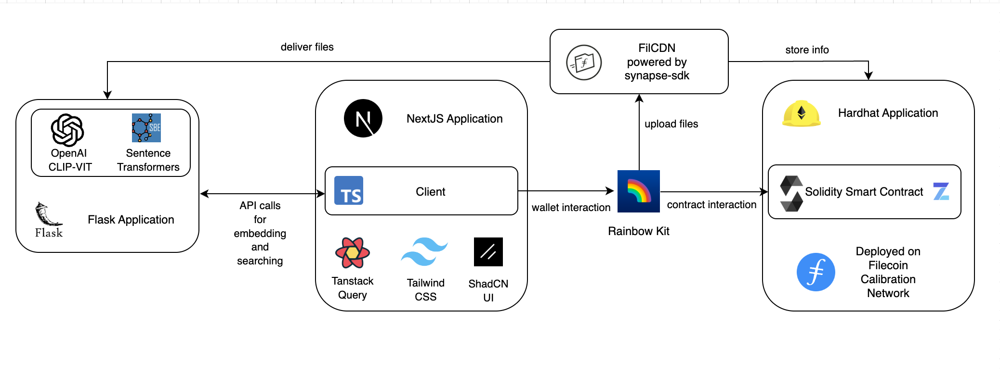

# FilDOS - AI-Native Decentralized Storage

**A Secure, AI-Native, Meaning-First Decentralized Drive**

FilDOS is a revolutionary decentralized storage platform built on Filecoin that enables users to store, search, and share files by meaning rather than cryptic identifiers like CIDs. It combines the power of blockchain technology with AI-driven semantic search to create a truly human-centric storage experience.


## 🚀 Key Features

- **🔍 Semantic Search**: Find files by meaning, not CIDs
- **📂 NFT-Based Folders**: Folders as ERC-721 NFTs with embedded metadata and access control
- **📦 Drive Capsules**: Every file becomes a portable capsule with metadata and embeddings
- **🔗 Agent-Compatible**: Designed for AI agents to own, manage, and interact with storage

## 🏗️ Architecture

### Core Components

- **Frontend**: Next.js 15 with TypeScript, Tailwind CSS, and shadcn/ui
- **Blockchain**: Filecoin FEVM (Calibration testnet) for folder NFTs
- **Storage**: Filecoin Storage Providers for decentralized file storage and FilCDN
- **AI Service**: Flask-based API with CLIP and SentenceTransformers
- **Smart Contracts**: ERC-721 NFTs for folder ownership and access control



## 🛠️ Getting Started

### Prerequisites

- Node.js 18+ and npm/yarn
- Python 3.8+ (for AI service)
- MetaMask or compatible Web3 wallet
- Filecoin Calibration network configuration

### Installation

1. **Clone the repository**
   ```bash
   git clone <repository-url>
   cd FilDOS
   ```

2. **Install frontend dependencies**
   ```bash
   npm install
   ```

3. **Set up the AI service**
   ```bash
   cd ai
   pip install -r requirements.txt
   ```

### Running the Application

1. **Start the AI service** (in `ai/` directory):
   ```bash
   python start.py
   ```

2. **Start the frontend** (in root directory):
   ```bash
   npm run dev
   ```

3. **Open your browser** to `http://localhost:3000`
   


## 📖 Usage

### Basic Workflow

1. **Connect Wallet**: Connect your MetaMask to Filecoin Calibration network
2. **Purchase Storage**: Buy storage to create your first folder NFT
3. **Upload Files**: Upload files with automatic AI-powered metadata generation
4. **Semantic Search**: Search files using natural language queries
5. **Share & Collaborate**: Share folders using blockchain-based permissions

### Example Searches

- `"meeting notes"`
- `"design documents about authentication"`
- `"photos from the conference"`

## 🤖 AI Service

The AI service provides:
- **Multi-modal Embeddings**: CLIP for images, BERT for text
- **Semantic Search**: Vector similarity search across all file types
- **Content Analysis**: Automatic metadata extraction and summarization
- **Stateless Design**: No server-side storage, perfect for multi-user scenarios

See `ai/README.md` for detailed AI service documentation.

## 🔐 Smart Contracts

FilDOS uses ERC-721 NFTs for folder management:
- **Ownership**: NFT defines folder control
- **Access Control**: View/edit permissions based on ownership
- **Programmability**: Smart contract logic for sharing and delegation
- **Metadata**: On-chain storage of folder metadata and indexes

Contract deployment on Filecoin Calibration testnet.

## 🎨 UI Components

Built with modern, accessible components:
- **shadcn/ui**: High-quality UI components
- **Tailwind CSS**: Utility-first styling
- **Framer Motion**: Smooth animations
- **Lucide Icons**: Consistent iconography

---

**"Forget CIDs. Access your files like you think — by meaning."**
